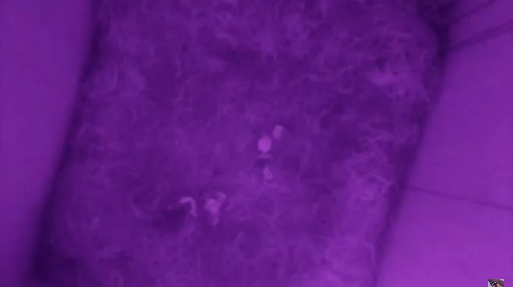

# Raspberry Pi Bird Box Camera

Place a Raspberry Pi with infrared camera in a bird box and watch young birds grow up, via a YouTube livestream.


## Requirements

- Raspberry Pi with WiFi. You could provide WiFi via a dongle, but the best option is to use a [Raspberry Pi >=3](https://www.raspberrypi.org/products/raspberry-pi-4-model-b/), with built in WiFi.
- [Raspberry Pi NoIR Camera module](https://www.raspberrypi.org/products/pi-noir-camera-v2/)
- Infrared LED
- 220 ohm resistor
- Some (jumper) wires
- A bird box!

## How I made it

### The box

My granddad made a bird box for me. It has a ceiling in it, so the Raspberry Pi and all wiring etc. are protected against all types of weather circumstances (except [football-sized hailstones](https://edition.cnn.com/2020/05/02/weather/gargantuan-hailstones-record-scn-trnd/index.html)).


| The box | The top | The power cable |
|--|--|--|
|  |  |  |

### Wiring

**NOTE:** you may have to focus your lens. See [this guide](https://www.jeffgeerling.com/blog/2017/fixing-blurry-focus-on-some-raspberry-pi-camera-v2-models) to ajusting the camera focus.


## Streaming

You may use another streaming service, but my Pi streams the nest footage to YouTube using a simple [Python script](youtube.py). You'll need to set up YT:

1. Log in to YouTube and click your profile image. Click _YouTube Studio_.

   

2. Click the _Go Live_ icon in the top right.

   

3. Set up your stream.

4. You'll now get a streaming key; copy it.

   

5. Clone this [repository](https://github.com/garraflavatra/rpi_birdbox_camera) (or just the two files `youtube.py` and `youtube-key.txt`) to `/opt/birdbox/`.

6. Paste the streaming key into `youtube-key.txt` and replace all other content with it.

7. Execute the script:

   ```bash
   python3 /opt/birdbox/youtube.py
   ```

8. You can now see the footage, live!

   

   _Yes, there's been a [great tit](https://en.wikipedia.org/wiki/Great_tit) family here before.

---

Good luck and thanks for checking out this project.
